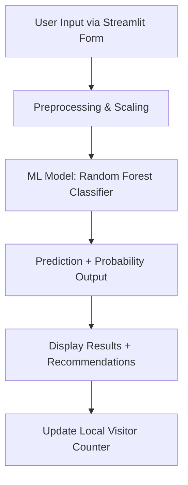

# 💖 **Heart Disease Prediction Web App**


---

<p align="center">
  
</p>

## 🚀 **Live Demo**
[Visit the app here](https://heart-disease-prediction-bksmkk57tszguvmccwvdgr.streamlit.app/)

---

## 📝 **Project Overview**

An intelligent, interactive, and visually appealing **Heart Disease Risk Estimator App**, powered by **Machine Learning (Random Forest Classifier)** and presented via a clean **Streamlit Web Interface**.

💡 **Core Objective**: To provide fast, simple, and accurate heart disease risk prediction for healthcare screening purposes.

---

## ✨ **Features**

- 🧠 **ML-Powered Risk Prediction** (Random Forest - 98.5% Accuracy)
- 🌟 **Confidence Score Displayed**
- 💬 **Health Recommendations Based on Results**
- 📈 **Visitor Analytics Dashboard (Local Counter)**
- 🗂️ **FAQ, Disclaimer, Analytics Tabs**
- 🔒 **No User Data Stored / Privacy Ensured**
- 🎨 **Modern, Interactive UI using `streamlit-option-menu`**

---

## ⚙️ **Technology Stack**

| Layer        | Tools / Libraries                  |
|-------------|------------------------------------|
| **Frontend**| Streamlit, HTML/CSS (Streamlit Components) |
| **Backend** | Python 3, Scikit-Learn, Pickle     |
| **ML Models** | Random Forest (Deployed), KNN, SVM, Logistic Regression |
| **EDA/Training** | Pandas, Seaborn, Matplotlib     |
| **Storage** | Pickle (`.sav`, `.pkl` files)      |

---

## 🏗️ **Architecture Diagram**



---

## 📊 **ML Model Performance**

| Model                | Accuracy | Recall | F1 Score |
|---------------------|----------|--------|----------|
| Logistic Regression | 80%      | 87.4%  | 81.4%    |
| KNN Classifier       | 85.8%    | 88.3%  | 86.3%    |
| SVM Classifier       | 88.2%    | 93.2%  | 88.9%    |
| 🌟 **Random Forest (Deployed)** | **98.5%**  | **97.1%**  | **98.5%**    |

> **Best Model Saved As**: `heart_disease_model1.sav`

---

## 🏃‍♂️ **Quick Start Guide**

```bash
# Clone the repo
git clone https://github.com/yourusername/heart-disease-predictor.git
cd heart-disease-predictor

# Install dependencies
pip install -r requirements.txt

# Launch the app
streamlit run app.py
```

Visit: `http://localhost:8501`

---

## 📂 **Project Structure**

```
├── app.py                  # Streamlit Web App
├── heart_disease_model1.sav # Trained Random Forest Model
├── visitor_data.pkl        # Local Visitor Counter
├── Heart_Disease_Prediction.pdf # ML Training Report
├── requirements.txt        # Python Libraries
└── README.md               # This Documentation
```

---

## 🔮 **Future Enhancements**

- 🌍 Deploy on Streamlit Cloud or Hugging Face Spaces
- 🔑 User Login & History Tracking
- 📊 SHAP/LIME Explainability Integration
- 🏥 API for Real-time Hospital Use
- 🌐 Multi-language Support

---

## 🤝 **Contributing**

1. Fork this repository.
2. Create a new branch: `git checkout -b feature-branch`.
3. Commit your changes: `git commit -m 'Add new feature'`.
4. Push to the branch: `git push origin feature-branch`.
5. Open a Pull Request.

---

## ⚠️ **Disclaimer**

> This application is **NOT a substitute for professional medical advice**. Always consult a certified healthcare provider for medical decisions.

---

## 📄 **License**

MIT License

---

<p align="center">
  <b>Made with Enock Bereka for health and data science.</b>
</p>

